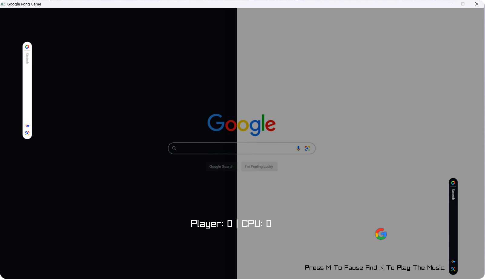

# 🕹️ Google Search Bar Pong Game

- This project is a creative twist on the classic Pong game, reimagined with Google-themed visuals! Play as two search bars—one black, one white—and compete to score points by bouncing a Google-themed ball past the opponent’s paddle.

- Future Updates: Will Add The **Choose Difficulty** And Minor Bug Fixes.
  - Easy [Ez Pz.]
  - Medium [For Casuals]
  - Hard [Impossible To Defeat] <- Currently The Game Is Set By Default To Hard Mode.

- Will Compile It With **WebAssembly (Wasm)**, So That Players Can Play It Online.
  


# Game Preview:



`main.cpp`
``` c++
char name [50]; 
```

# Features:
- Dynamic Gameplay: The ball starts with a slow horizontal movement to allow the player to hit it, then gains speed after the first hit.
- Themed Visuals: Backgrounds, paddles, and the ball are all customized with Google-inspired textures, enhancing the gameplay experience.
- Automatic Opponent (CPU): A built-in AI controls one of the paddles, challenging you to test your skills.
- Scorekeeping: Keep track of both players' scores on the in-game scoreboard.
- Game Over Screen: Displays a win message for the player reaching the winning score limit.
- Toggle Backgrounds: Background images change every few seconds, adding visual interest.
- Future Additions:
I plan to implement new features, such as sound effects and background music, power-ups, and additional difficulty levels.

#Controls:
**Player 1** (Left Paddle):
- W - Move Up
- S - Move Down

**Player 2** (Right Paddle - CPU-controlled): 
- Reacts to the ball’s position automatically.

# Tech Stack:
Built using Raylib with C++, making use of textures, vector math, and collision handling.

# Installation & Setup
To get started with this Google-themed Pong game, follow the steps below to clone the repository, install dependencies, and run the project.

# Prerequisites
- **C++ Compiler:** Make sure you have a C++ compiler installed (e.g., GCC for Linux, MSVC for Windows, Xcode for macOS).
- **Raylib:** This project requires the Raylib library for graphics rendering.

# Install Raylib
- **Windows:**
  - Download the Raylib installer from [Raylib's official site.](https://www.raylib.com/)
  - Follow the installation instructions, and make sure the library files are accessible by your compiler.

- **Linux:**
```
sudo apt-get install libraylib-dev
```

- **macOS:**
```
brew install raylib
```

# Clone the Repository

1. Open your terminal or command prompt.
2. Clone the project repository:
   ```
   git clone https://github.com/yourusername/google-search-bar-pong.git
   cd google-search-bar-pong
   ```

**Build and Run**
- Compile the Project:
  - For Linux/macOS:
    ```
    g++ -o PongGame main.cpp -lraylib -std=c++11
    ```
    
- For Windows (assuming Raylib setup in MSVC):
  ```
  g++ -o PongGame main.cpp -lraylib -lopengl32 -lgdi32 -lwinmm -std=c++11
  ```

**Run the Game:**
```
./PongGame
```

**Controls**
- Player 1:
  - W - Move Up
  - S - Move Down
 

**Enjoy the game, and feel free to open issues or contribute to further improve it!**
